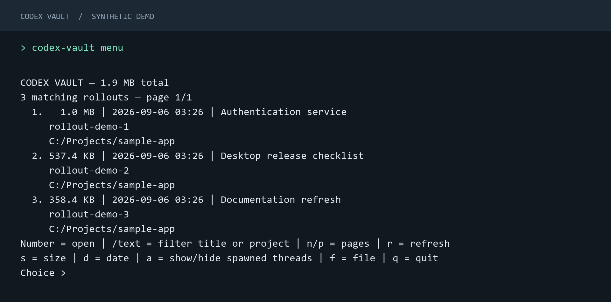

# Codex Vault

**Recover, verify and safely compact local Codex conversations.**

- Verified recovery snapshots before replacing a transcript.
- Refuses unsafe or unsupported compaction layouts.
- Restores exact previously recorded states.
- Differentially tested against Codex reconstruction.
- Windows-first, with local SQLite search and read-only MCP tools.

**Preview release · MIT · Windows x86_64**

[Download](https://github.com/nassim-arifette/codex-vault/releases) · [CLI guide](docs/cli.md) · [Safety model](docs/safety-model.md) · [Roadmap](docs/roadmap.md)

## Install

1. Download the Windows ZIP and `SHA256SUMS.txt` from [Releases](https://github.com/nassim-arifette/codex-vault/releases).
2. Compare the ZIP's `Get-FileHash -Algorithm SHA256` result with `SHA256SUMS.txt`, then extract it.
3. In the extracted directory, run:

```powershell
powershell -NoProfile -ExecutionPolicy Bypass -File .\install.ps1
```

Open a new terminal and run `codex-vault --help`. The installer checks the executable's checksum
and adds it to your user PATH. No administrator rights, Rust, Node or separate SQLite installation
are needed. The Windows binary is unsigned. [Detailed installation steps](docs/cli.md#installation)

## Quick start

Choose a conversation in the terminal menu:

```powershell
codex-vault menu
```



*Actual CLI output rendered for documentation, using synthetic data.*

Or use direct commands from your project directory. Replace `SESSION_ID` with an ID or full
rollout path from `scan`:

```powershell
codex-vault scan --cwd .
codex-vault compact SESSION_ID --dry-run
codex-vault compact SESSION_ID
codex-vault doctor SESSION_ID --deep
```

Close the relevant Codex session before compacting or restoring. Direct commands apply without
a confirmation prompt; the menu asks first. To restore the first saved state, use
`codex-vault restore SESSION_ID --original`.

To find an older message:

```powershell
codex-vault index --cwd .
codex-vault search "authentication tokens" --cwd .
codex-vault read PASSAGE_ID
```

Copy `PASSAGE_ID` from search results. Re-run `index` after conversations change.
[Connect the read-only MCP tools to Codex](docs/search-and-mcp.md#use-from-codex-through-mcp).

## Why this exists

Long Codex conversations can leave large local rollout files, even after Codex compacts the
context it sends to the model. Vault checks whether an older prefix can be removed while
preserving Codex's supported reconstruction behavior. It retains a verified recovery snapshot
and makes archived user and assistant messages searchable.

A smaller rollout does **not** always mean less disk usage: retained backups cost space.
`compact --dry-run` estimates the net change; completed operations include backups and metadata
in their storage report and warn when total usage increases.

## Tested locally

The public **v0.2.1 Windows ZIP** completed the full archive → compact → restore → search
sequence on generated 1, 5 and 10 GB rollouts:

| Synthetic input | Peak CLI RAM | Net space saved* | Exact SHA-256 restore |
| --- | ---: | ---: | --- |
| 1 GB | 23.2 MB | 73.39% | Passed |
| 5 GB | 27.0 MB | 73.37% | Passed |
| 10 GB | 27.2 MB | 73.37% | Passed |

*Includes the compacted transcript, retained backups, journal and search index. This is a
compressible synthetic workload, not a savings forecast. Decimal GB/MB; one local Windows run.*

Five representative real rollouts also passed their expected compaction/refusal checks with
Codex as the reconstruction oracle for allowed cases. One **278.40 MB real copy used 117.98 MB
after compaction and indexing — 57.62% net saved** — and restored exactly. The ZIP was installed
and exercised locally through the user PATH. [Results, methodology and limits](docs/benchmarks.md).

## Safety model

Vault verifies backups before replacement, records recovery references in a journal and checks
the result afterward. Unsupported layouts, pages required by later rollouts and spawned threads
are protected; Codex-managed compressed rollouts remain read-only.

CI checks reconstruction with **Codex 0.152.1 and 0.153.4**, plus Windows/Linux tests and installation
on a fresh Windows runner. This covers the tested cases, not every future Codex format.
[How recovery works](docs/safety-model.md) · [What the harness proves](docs/differential-testing.md)

## Documentation

| Guide | Contents |
| --- | --- |
| [CLI](docs/cli.md) | Installation, menu, command examples, scripting and exit codes |
| [Safety model](docs/safety-model.md) | Backup, locking, replacement and storage guarantees |
| [Codex format](docs/codex-format.md) | Cutoffs, pagination and compatibility boundaries |
| [Differential testing](docs/differential-testing.md) | Synthetic fixtures, reconstruction oracle and negative control |
| [Recovery journal](docs/recovery-journal.md) | Archive layout, recorded states and interrupted operations |
| [Search and MCP](docs/search-and-mcp.md) | Indexing, exact passage references and Codex setup |
| [Development](docs/development.md) | Source layout, builds, tests and release packaging |
| [Local validation](docs/benchmarks.md) | Multi-GB measurements, real-rollout corpus and local ZIP installation |

## Planned improvements

- **Guided `repair`** for supported damage or interrupted operations, with a reviewable plan and recovery snapshot before changes.
- Easier index refresh and clearer backup storage management across repeated compactions.
- More Codex versions, rollout variants and concurrent live-session tests.
- Broader platform distribution and Windows code signing.

These are planned, not shipped features. There is currently **no `repair` command**;
`doctor` diagnoses and `restore` recovers recorded states. [See the roadmap](docs/roadmap.md).

## License

[MIT](LICENSE). Public fixtures are synthetic. Conversations, local indices and private validation
reports are excluded from the repository and release artifacts.
