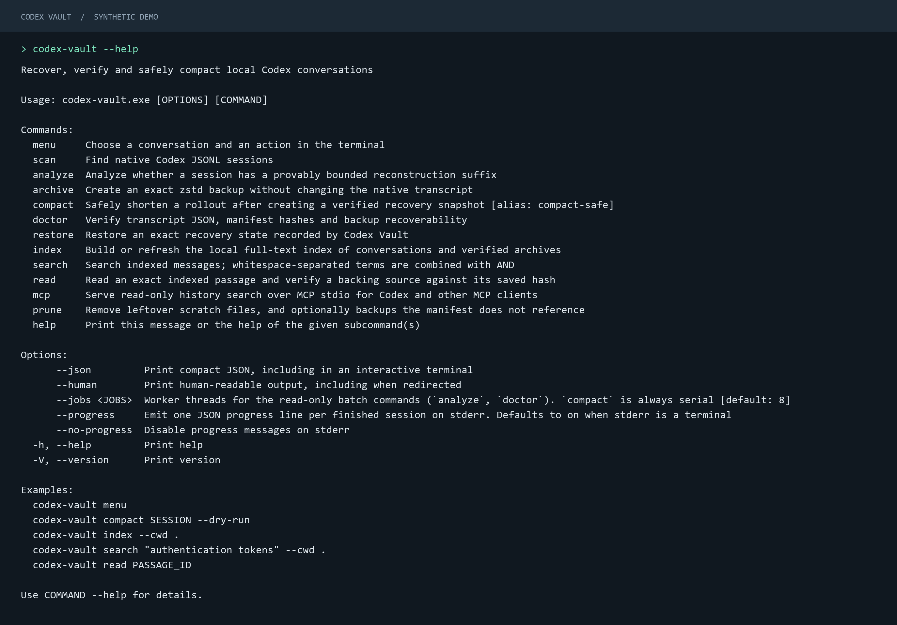

# CLI guide

[Back to the overview](../README.md)

Use `codex-vault --help` for the command list and `codex-vault COMMAND --help` for
descriptions and examples. `compact` is the primary command; `compact-safe` remains an alias.



*Output captured from the Windows release executable and rendered as a documentation preview.*

## Installation

Download the Windows x86_64 ZIP and `SHA256SUMS.txt` from
[Releases](https://github.com/nassim-arifette/codex-vault/releases) into the same directory.
In PowerShell, calculate the ZIP checksum:

```powershell
Get-FileHash .\codex-vault-*-windows-x86_64.zip -Algorithm SHA256
Get-Content .\SHA256SUMS.txt
```

Check that the hash for the matching filename is identical. Extract that ZIP, open PowerShell
in the extracted directory and install:

```powershell
powershell -NoProfile -ExecutionPolicy Bypass -File .\install.ps1
```

The installer verifies the executable checksum, copies it to
`%LOCALAPPDATA%\Programs\CodexVault` and adds that directory to your user PATH. Open a new terminal
and run `codex-vault --version`. The executable bundles SQLite and the C runtime; no administrator
rights or development toolchain are required. It is unsigned.

For a custom location, pass `-InstallDirectory C:\tools\CodexVault` to the installer.
`-NoPath` skips PATH changes. You can also run `codex-vault.exe` directly from the extracted ZIP.
To update, close running Vault/MCP processes and install the newer verified ZIP. Installation
does not alter your conversation files or vault. [Build from source](development.md) if preferred.

## Menu

```powershell
codex-vault menu
codex-vault menu --cwd C:\projects\sample-app
```

The menu lists titles, project paths, sizes and rollout files. Enter a number to select one.
Use `/text` to filter titles or projects, `s` to sort by size, `d` by date, `n`/`p` for pages,
`r` to refresh and `q` to quit. `a` shows or hides spawned threads; `f` opens a rollout by path.

Compaction previews net savings before asking for confirmation. Compaction and restoration
require `y` or `yes`; Enter, `n` or end-of-input cancel. With no command, Vault opens the menu
when both stdin and stdout are terminals; otherwise it shows help and exits with code 2.

## Session references and project filters

`scan` shows the **five largest rollout files**, with conversation titles, short project names
and a copyable `Ref`. Add `--all` to list every matching file, still largest first. Add `--paths`
when you need full project and rollout paths, including projects with the same directory name.

```powershell
codex-vault scan
codex-vault scan --all
codex-vault scan --cwd . --paths
codex-vault --json scan
```

The summary always counts all matching files. JSON output (also the default when redirected)
continues to include **every** matching file and its complete metadata; `--all` and `--paths`
only affect readable output. Use `--human` to keep the readable summary when redirecting.

In the examples, replace `SESSION_ID` with a session ID, a rollout filename stem or a full
rollout path returned by `scan`. `Ref` uses a filename stem when several pages share a session ID;
use `scan --paths` for a full path to a particular file.
Quote paths containing spaces. `--session SESSION_ID` remains available on analyze, archive,
compact and doctor as an alternative to the positional argument.

`--cwd` filters discovery by the project recorded in the rollout; it does not change the shell's
working directory. Discovery commands match related project paths, including parent and child
directories. A compaction batch only includes rollouts whose own project is **inside** the
specified directory. Explicit rollout paths are used directly, so `--cwd` is not an access
control boundary for single-file commands. Search/MCP scopes are described in
[Search and MCP](search-and-mcp.md).

## Inspect, back up and compact

Run these examples from your project directory:

```powershell
codex-vault scan --cwd .
codex-vault analyze SESSION_ID
codex-vault archive SESSION_ID
codex-vault compact SESSION_ID --dry-run
codex-vault compact SESSION_ID
codex-vault doctor SESSION_ID --deep
```

Close the relevant Codex session before compaction or restoration. Direct commands apply
without a confirmation prompt. `archive` preserves the first immutable backup;
`archive SESSION_ID --force` adds a new snapshot without replacing it.

`compact --dry-run` writes nothing and estimates the new compressed backup. Its net estimate
excludes journal growth. The completed compaction report counts retained backups and metadata;
negative savings mean total storage increased. Already compacted files return `already_compact`
without rewriting the transcript or its restore target. See the
[storage accounting rules](safety-model.md#storage-accounting).

`doctor` checks hashes and the recovery journal. `--deep` also decompresses every recorded
archive and parses the transcript. It diagnoses problems; it does not repair them.

## Restore a recorded state

```powershell
codex-vault restore SESSION_ID --list
codex-vault restore SESSION_ID
codex-vault restore SESSION_ID --original
```

These commands respectively list recovery states, restore the newest recorded state and restore
the first immutable backup. To select another state, copy its path from `--list`:

```powershell
codex-vault restore SESSION_ID --to "C:\backups\recorded-snapshot.jsonl.zst"
```

The path must belong to that rollout's journal. Restore saves the current transcript before
replacing it, so that state remains recoverable. [Recovery journal details](recovery-journal.md)

## Batches and cleanup

```powershell
codex-vault --jobs 8 analyze --cwd .
codex-vault doctor --cwd .
codex-vault compact --cwd . --dry-run
codex-vault prune --session SESSION_ID
codex-vault prune --session SESSION_ID --apply
```

Analyze and doctor use worker threads with deterministic output order. One unreadable rollout
produces an error row rather than discarding the whole batch. Compaction is serial and requires
either a session or `--cwd`; a bare `compact` is refused.

Prune is a dry run unless `--apply` is present. `--unreferenced-backups` includes backups that
no recovery journal references. Referenced recovery snapshots are retained, and an unreadable
journal prevents judging backups safe to remove. This is not a backup retention policy.

Pages needed by later rollouts cannot be compacted. Spawned threads are protected by default;
`--allow-spawned-threads` overrides that protection for unvalidated cases. Codex-managed
`.jsonl.zst` rollouts remain read-only. [Format and compatibility details](codex-format.md)

## Search history

```powershell
codex-vault index --cwd .
codex-vault search "authentication tokens" --cwd . --limit 10
codex-vault read PASSAGE_ID
```

Run `index` first, then copy a passage ID from search results. Search `--offset` skips matches;
read `--offset` skips Unicode characters. [Index lifecycle and MCP setup](search-and-mcp.md)

## Scripting and exit codes

Results go to stdout: readable text in an interactive terminal, pretty JSON when redirected.
`--json` always prints compact JSON; `--human` forces readable text in a pipe. A batch is one
JSON document. `--progress` sends JSON progress lines to stderr; it defaults on when stderr
is a terminal. `--no-progress` disables it. MCP uses its own JSON-RPC stdio transport.

```powershell
$report = codex-vault --json --no-progress doctor SESSION_ID | ConvertFrom-Json
$exitCode = $LASTEXITCODE
$report
```

Errors are readable in a terminal, or JSON when redirected/using `--json`, with a stable `code`.
Verification warnings, failed restores and batch errors return nonzero status. Expected batch
skips do not. An error after replacement explicitly includes `native_transcript_changed: true`
and identifies the recovery journal.

| Exit | Meaning |
| --- | --- |
| 0 | Success |
| 1 | Internal invariant violation |
| 2 | Invalid request or unsupported session kind |
| 3 | Session or backup not found |
| 4 | Integrity or index failure |
| 5 | Session in use or changed during the operation |
| 6 | Filesystem error |
